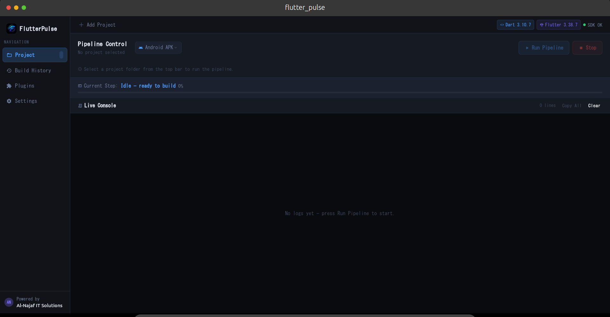
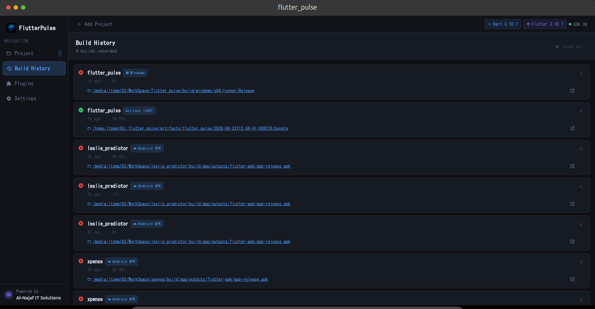
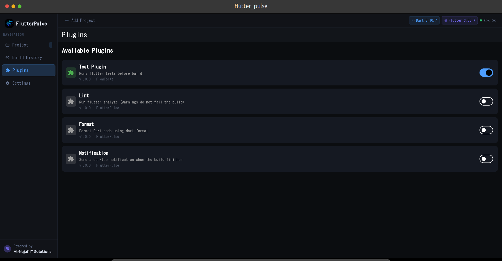
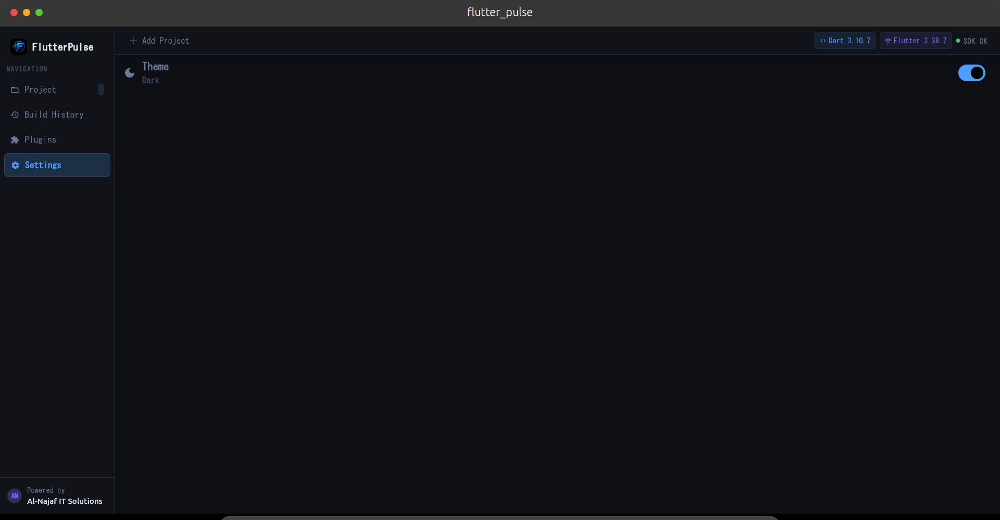

<div align="center">
  
  
  # FlutterPulse 
  
  A lightweight, open-source CI/CD automation tool for Flutter developers.
</div>
# FlutterPulse 

[](https://opensource.org/licenses/MIT)
[](https://flutter.dev)
[](https://flutter.dev)
[](https://github.com)

**FlutterPulse** is a lightweight, open-source CI/CD automation tool for Flutter developers. Built by [Al-Najaf IT Solutions](https://alnajaf-it.com), it provides a desktop application that automates your Flutter project builds with a clean UI, live logging, build history, and a powerful plugin system.



---

## ✨ Features

- **⚡ One-Click Build Pipeline** – Clean → Get → Plugins → Build (APK, Linux, Windows, Web, DEB)
- **📊 Live Progress Tracking** – Visual pipeline steps with real-time status updates
- **📝 Live Console** – Full build output with color-coded logs and copy support
- **📦 Versioned Artifact Storage** – Every build is saved with timestamp and can be accessed anytime
- **🧩 Plugin System** – Extend your pipeline with custom plugins (Lint, Format, Test, Notify, Backup)
- **📜 Build History** – Track all builds with status, duration, and output path
- **🌓 Dark Theme** – Professional dark UI optimized for developers
- **🔌 Plugin Management** – Enable/disable plugins via UI or config file

---

## 📸 Screenshots

Place your screenshots in the `assets/screenshots/` folder:

### Pipeline Dashboard


### Build History


### Plugin Management


### Settings Screen


---

## 🏗️ Architecture & Folder Structure

```
flutter_pulse/
├── lib/
│   ├── core/
│   │   ├── constants.dart          # App colors, constants
│   │   ├── result.dart             # Result wrapper class
│   │   └── pipeline/
│   │       └── plugin_registry.dart # Plugin registration
│   │
│   ├── models/
│   │   ├── build_history_model.dart
│   │   ├── build_target.dart
│   │   ├── log_entry_model.dart
│   │   ├── pipeline_step_model.dart
│   │   └── project_model.dart
│   │
│   ├── plugins/
│   │   ├── pipeline_plugin/
│   │   │   └── pipeline_plugin.dart # Abstract plugin interface
│   │   └── implementations/
│   │       ├── test_plugin.dart
│   │       ├── lint_plugin.dart
│   │       ├── format_plugin.dart
│   │       └── notify_plugin.dart
│   │
│   ├── service/
│   │   ├── build_service.dart       # Bash script executor
│   │   ├── config_service.dart      # JSON config loader
│   │   ├── history_service.dart     # History storage
│   │   ├── artifact_storage_service.dart
│   │   ├── project_service.dart
│   │   ├── sdk_service.dart
│   │   └── file_service.dart
│   │
│   ├── ui/
│   │   ├── screens/
│   │   │   ├── home_screen.dart
│   │   │   ├── build_history_screen.dart
│   │   │   ├── plugins_screen.dart
│   │   │   └── settings_screen.dart
│   │   └── widgets/
│   │       ├── sidebar.dart
│   │       ├── topbar.dart
│   │       ├── glow_button.dart
│   │       ├── log_line.dart
│   │       └── pipeline/
│   │           ├── pipeline_dashboard.dart
│   │           └── pipeline_step_chip.dart
│   │
│   ├── viewModels/
│   │   ├── build_viewmodel.dart
│   │   ├── history_viewmodel.dart
│   │   ├── pick_directory_viewmodel.dart
│   │   ├── sdk_info_viewmodel.dart
│   │   └── theme_viewmodel.dart
│   │
│   └── main.dart                   # App entry point
│
├── assets/
│   ├── config/
│   │   └── pipeline_config.json    # Plugin configuration
│   └── screenshots/                # App screenshots (add here)
│       ├── dashboard.png
│       ├── history.png
│       ├── plugins.png
│       └── settings.png
│
├── pubspec.yaml
├── analysis_options.yaml
├── LICENSE
├── README.md
└── .gitignore
```

---

## 🚀 Getting Started

### Prerequisites

- **Flutter 3.22+** ([Installation Guide](https://docs.flutter.dev/get-started/install))
- **Android SDK** (for Android builds) – if targeting Android
- **Linux:** `libgtk-3-dev` and `ninja-build`
  ```bash
  sudo apt install libgtk-3-dev ninja-build
  ```

### Installation

1. **Clone the repository**
   ```bash
   git clone https://github.com/itxmal03/FlutterPulse
   ```

2. **Install dependencies**
   ```bash
   flutter pub get
   ```

3. **Run the application**
   ```bash
   flutter run -d linux   # or windows, macos
   ```

### Build a Release Version

```bash
flutter build linux      # or windows, macos
```

The built executable will be in `build/linux/x64/release/bundle/`.

---

## 📖 Usage Guide

### 1. Select Your Flutter Project
Click **"Add Project"** in the top bar and select your Flutter project folder.

### 2. Choose Build Target
Select your desired platform from the dropdown:
- **Android APK** – `flutter build apk`
- **Linux (x64)** – `flutter build linux`
- **Windows** – `flutter build windows`
- **Web** – `flutter build web`
- **Linux DEB** – `flutter build linux && dpkg-deb`

### 3. Configure Plugins
Navigate to the **Plugins** tab and enable/disable plugins:
- **Test** – Runs `flutter test` before the build
- **Lint** – Runs `flutter analyze` (warnings don't fail the build)
- **Format** – Formats your code with `dart format .`
- **Notify** – Sends a desktop notification on build completion

### 4. Run the Pipeline
Click **"Run Pipeline"** to start the build. Watch the live logs and progress in real-time.

### 5. View Build History
Navigate to **"Build History"** to see all previous builds. Each record includes:
- Build status (success/failed)
- Timestamp and duration
- Output path (click to open)
- Stored artifact path (versioned)

### 6. Access Artifacts
All successful builds are stored in `~/.flutter_pulse/artifacts/` with timestamps. You can open the folder directly from the history screen.

---

## 🧩 Plugin System

FlutterPulse has a flexible plugin system that allows you to extend the pipeline.

### Available Plugins

| Plugin | ID | Type | Description |
|--------|-----|------|-------------|
| **Test** | `test` | Pre-build | Runs `flutter test` |
| **Lint** | `lint` | Pre-build | Runs `flutter analyze` |
| **Format** | `format` | Pre-build | Runs `dart format .` |
| **Notify** | `notify` | Post-build | Sends desktop notification |
| **Backup** | `backup` | Pre-build | Backs up project before build *(coming soon)* |

### Creating a Custom Plugin

1. **Create a new class** implementing `PipelinePlugin`:
   ```dart
   class MyPlugin extends PipelinePlugin {
     @override
     String get id => "my_plugin";
     
     @override
     String get name => "My Plugin";
     
     @override
     String get description => "Does something useful";
     
     @override
     bool get isPreBuild => true; // or false for post-build
     
     @override
     List<PipelineStep> buildSteps() {
       return [
         PipelineStep("My Step", "flutter some_command"),
       ];
     }
   }
   ```

2. **Register it** in `lib/core/pipeline/plugin_registry.dart`:
   ```dart
   static final Map<String, PipelinePlugin> available = {
     ...others,
     "my_plugin": MyPlugin(),
   };
   ```

3. **Add to config** (`assets/config/pipeline_config.json`):
   ```json
   {
     "my_plugin": {
       "enabled": false,
       "args": {}
     }
   }
   ```

---

## 🔧 Configuration

### Pipeline Configuration (`assets/config/pipeline_config.json`)

```json
{
  "test": {
    "enabled": true,
    "args": {}
  },
  "lint": {
    "enabled": false,
    "args": {}
  },
  "format": {
    "enabled": false,
    "args": {}
  },
  "notify": {
    "enabled": false,
    "args": {}
  }
}
```

- **enabled** – Toggle plugin on/off
- **args** – Reserved for future plugin parameterization

### Build History Storage

Build records are stored in `~/.flutter_pulse/history.json`

Artifacts are stored in `~/.flutter_pulse/artifacts/{projectName}/{timestamp}/`

---

## 🤝 Contributing

Contributions are welcome! Here's how you can help:

1. **Fork the repository** and create your branch
2. **Submit issues** for bugs or feature requests
3. **Open pull requests** with improvements
4. **Share feedback** – we'd love to hear your thoughts!

### Development Setup

1. Install Flutter 3.22+ and set up your preferred IDE
2. Run `flutter pub get` to install dependencies
3. Use `flutter run` to test your changes
4. Follow the code style (we use `dart format`)

### Reporting Issues

Please use the issue templates and provide:
- Steps to reproduce
- Expected vs actual behavior
- Logs and screenshots if applicable

---

## 📄 License

FlutterPulse is released under the **MIT License**. See the [LICENSE](LICENSE) file for details.

---

## 🙏 Acknowledgments

- Built using Flutter
- Developed by **Muhammad Aftab Liaqat** at **Al-Najaf IT Solutions**
- Inspired by CI/CD tools and the need for a lightweight Flutter automation solution

---

## 📬 Contact & Support

- **Developer:** Muhammad Aftab Liaqat
- **Company:** Al-Najaf IT Solutions
- **GitHub:** [@itxmal03](https://github.com/itxmal03)
- **Email:** najafdevs@gmail.com

---

## ⭐ Show Your Support

If you find FlutterPulse useful, please ⭐ star the repository and share it with the Flutter community!

---

**Happy Building! 🚀**
